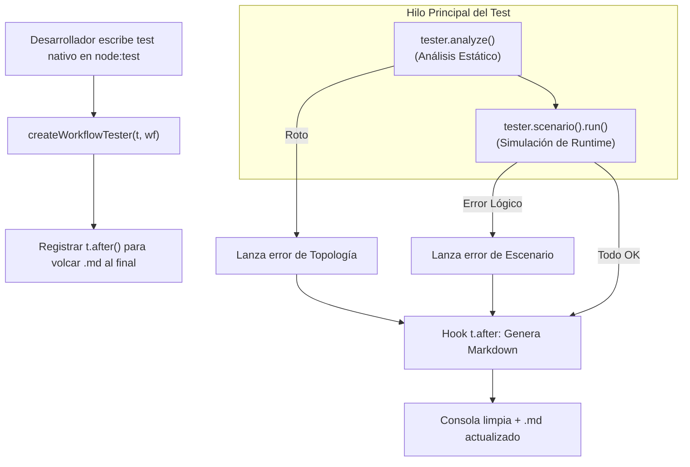

## Plan de Arquitectura: Workflow Tester Atómico & Documentación Viva
Este componente actúa como un orquestador unificado de pruebas y documentación. Su objetivo es encapsular el análisis estático, la simulación de runtime y la generación de reportes visuales en un solo ítem de test nativo de node:test, garantizando una consola limpia y documentación automatizada en caso de éxito o fallo.
## 1. Filosofía de Diseño (DX de Élite)

* Unicidad Atómica: El test completo pasa o falla como un solo bloque en la consola de Node.js. Evita el ruido de sub-tests múltiples.
* Garantía de Documentación: Gracias a los hooks nativos de ejecución, el archivo Markdown (.docs.md) con diagramas Mermaid e informes se genera siempre, incluso si el test explota a mitad de camino.
* Cero Configuración Manual: El desarrollador no escribe rutas de archivos ni configuraciones repetitivas; el nombre del reporte se deduce automáticamente a partir del string del test.

------------------------------
## 2. Diagrama de Flujo del Tester (Ciclo de Vida)


------------------------------
## 3. Contrato de Interfaz y Firmas Esenciales (TypeScript)
Para que Gemini/Claude entienda las restricciones de tipos y la fluidez del Builder, estas son las firmas clave que gobernarán el módulo:

```typescript
// @dx-flow/testerimport { TestContext } from 'node:test';
export interface ScenarioChain<TState, TServices> {
  withInitialState(customState: Partial<TState>): this;
  withServices(mockServices: Partial<TServices>): this;
  expectEndNode(nodeId: string): this;
  expectState(assertionFn: (state: TState) => void): this;
  run(): Promise<void>; // Ejecuta en el hilo principal y muta el log de traza
}
export interface WorkflowTester<TState, TServices> {
  analyze(): void; // Ejecuta el Paso 6 y aborta si isValid es false
  scenario(name: string): ScenarioChain<TState, TServices>;
}
// Factoría principalexport function createWorkflowTester<TState, TServices, TMutations>(
  t: TestContext,
  workflow: any
): WorkflowTester<TState, TServices>;
```

------------------------------
## 4. Mecánica Interna para la IA (Instrucciones de Implementación)
Cuando le pidas a Antigravity programar este módulo, dile que aplique estas tres reglas estrictas:

   1. Deducción de Nombre Dinámica: Debe leer t.name, sanitizarlo a formato kebab-case (ej. "Checkout Feliz" se convierte en "checkout-feliz") y usar esa cadena para nombrar el archivo final docs/checkout-feliz.docs.md.
   2. Hook de Escape (t.after): La llamada a generateMarkdownReport (del Paso 7) debe vivir estrictamente dentro de t.after(). Esto asegura que los estados intermedios recolectados en memoria se escriban en el archivo físico aunque ocurra un throw new Error.
   3. Aislamiento de Errores en Runtime: Dentro del método run() de cada escenario, se debe envolver la ejecución del motor (executeWorkflow) en un bloque try/catch. Si falla una aserción, se guarda el estado success: false y el mensaje de error en el log interno, y luego se vuelve a lanzar el error para que Node.js marque el test general como fallido.

------------------------------
## 5. El Resultado Esperado

* Si todo está bien: La consola muestra un elegante ✓ Mi Test y el desarrollador tiene un Markdown impecable con el grafo Mermaid en verde.
* Si el dev comete un error de lógica: La consola muestra un único error claro: [Fallo en Escenario: "Fallo de Tarjeta"] -> Se esperaba terminar en X pero terminó en Y. El desarrollador abre el .md generado y ve la traza exacta de qué nodo falló y cómo quedó el estado en ese instante.
