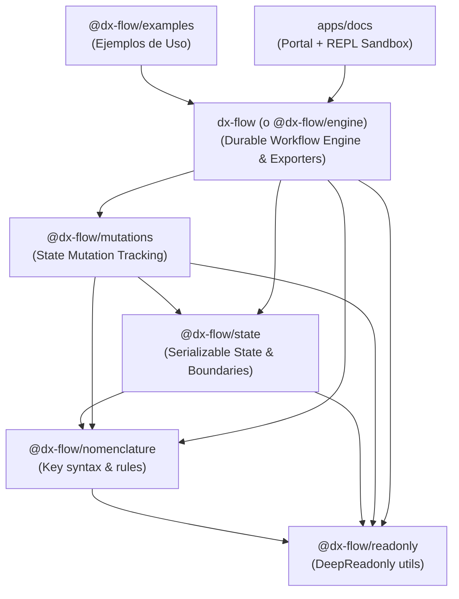

# Plan de Arquitectura y Reorganización Monorepo (`dx-flow` NPM Suite)

Este documento contiene la planificación estratégica para transformar la estructura de `dx-flow` en un **Monorepo (npm/pnpm workspaces)** modular listo para su publicación en `npmjs.com`, con cero dependencias de terceros en las librerías core, sitios de documentación individualizados, tutorial interactivo en vivo (Sandbox/REPL) y suite de ejemplos.

---

## 1. Estructura General del Monorepo

Convertir la carpeta `src/` monolítica en una arquitectura modular bajo la raíz `packages/` y `apps/`:

```
dx-flow/
├── package.json                   # Workspace root (npm/pnpm workspaces)
├── tsconfig.base.json             # Configuración base TypeScript compartida
├── packages/
│   ├── readonly/                  # @dx-flow/readonly
│   ├── nomenclature/              # @dx-flow/nomenclature
│   ├── state/                     # @dx-flow/state
│   ├── mutations/                 # @dx-flow/mutations
│   └── engine/                    # dx-flow (paquete principal del motor)
└── apps/
    ├── docs/                      # Portal de documentación + REPL Interactive Sandbox
    └── examples/                  # Suite de ejemplos funcionales de uso real
```

---

## 2. Mapa de Paquetes y Grafo de Dependencias (Zero 3rd-Party Deps)

Todas las librerías bajo `packages/` se construirán con **cero dependencias externas** (TypeScript puro), garantizando el menor tamaño posible y cero vulnerabilidades de cadena de suministro.



### Detalle de Paquetes NPM a Publicar

| Paquete NPM | Origen Actual | Propósito / Alcance | Dependencias Internas |
| :--- | :--- | :--- | :--- |
| **`@dx-flow/readonly`** | `src/core/deep-readonly.ts` | Utilidades de tipos `DeepReadonly` e inmutabilidad estática. | Ninguna |
| **`@dx-flow/nomenclature`** | `src/nomenclature/` | Validación y restricción de sintaxis/formato en keys de objetos (`snake_case`, `camelCase`, prefijos). | `@dx-flow/readonly` |
| **`@dx-flow/state`** | `src/state/` | Definición de estados serializables, profundidad máxima de objetos anidados y restricciones de tipos. | `@dx-flow/nomenclature`, `@dx-flow/readonly` |
| **`@dx-flow/mutations`** | `src/mutations/` | Mutaciones controladas, rastreo de cambios e inmutabilidad en tiempo de ejecución. | `@dx-flow/readonly`, `@dx-flow/nomenclature`, `@dx-flow/state` |
| **`dx-flow`** *(Paquete Principal)* | `src/workflow/` | Motor de workflow durable (`createWorkflow`, topología estática, exportadores visuales, nodos `wait`, retries, sagas). | `@dx-flow/*` (todas las anteriores) |

---

## 3. Estrategia de Build, Packaging y ESM/CJS Dual

Para permitir que cada paquete se consuma limpiamente en Node.js (ESM + CommonJS) y navegadores:

1. **Build Tooling por Paquete**:
   - `tsup` o `microbundle` para generar `dist/index.mjs` (ESM), `dist/index.cjs` (CJS) y `dist/index.d.ts` (Tipos).
2. **Standard Package Export (`exports` field)**:
   ```json
   "exports": {
     ".": {
       "types": "./dist/index.d.ts",
       "import": "./dist/index.mjs",
       "require": "./dist/index.cjs"
     }
   }
   ```
3. **TypeScript Project References**:
   - Uso de `tsconfig.json` con `"composite": true` y `"references"` para compilaciones incrementales y tipado inmediato entre paquetes sin requerir build continuo.

---

## 4. Ecosistema de Documentación y Portal Web (`apps/docs`)

### A. Documentación por Paquete
Cada subpaquete en `packages/*/` tendrá su propio `README.md` exhaustivo enfocado en su API minimalista y casos de uso aislados.

### B. Portal Principal (`apps/docs`)
- **Tecnología recomendada**: Astro (Starlight) o VitePress / Next.js.
- **Secciones**:
  1. **Landing Page**: Presentación visual interactiva con diagrama animado en vivo renderizado desde Mermaid nativo.
  2. **Guías**: Inicio rápido, arquitectura durable, patrones Saga y nodos de espera humanos (`type: "wait"`).
  3. **Referencia de API**: Secciones dedicadas a cada paquete del ecosistema.
  4. **Exportadores Visuales en Vivo**: Renderizador de BPMN 2.0 XML y Mermaid Flowchart/State.

### C. Tutorial Interactivo / Sandbox (Estilo Svelte REPL)
Entorno interactivo en el navegador sin backend ejecutor:
- **Editor en Tiempo Real**: Monaco Editor / CodeMirror con soporte de tipos TypeScript.
- **Visualizador Instantáneo de Grafo**: Al escribir `createWorkflow(...)`, el panel derecho actualizará en tiempo real:
  - Diagrama visual Mermaid / BPMN.
  - Guía narrativa en español.
  - Informe del Analizador de Topología Estática (errores de alcance, nodos huérfanos o bucles sin salida).
- **Simulador de Ejecución**: Paso a paso interactivo para simular eventos, transiciones de estado y expiración de SLAs `onTimeout`.

---

## 5. Suite de Ejemplos Prácticos (`apps/examples`)

Proyecto dedicado con escenarios reales para testing e2e y guía para la comunidad:
1. **`01-e-commerce-checkout`**: Flujo de compra con pago, reserva de stock, políticas de reintento y compensaciones Saga.
2. **`02-human-approval-wait-node`**: Flujo con nodo `wait` de 36 horas, escalado por SLA `onTimeout` y callback de aprobación.
3. **`03-subworkflows-composition`**: Composición modular de flujos usando subworkflows.
4. **`04-standalone-state-mutations`**: Uso independiente de `@dx-flow/state` y `@dx-flow/mutations` fuera del motor de workflows.

---

## 6. Hoja de Ruta para Ejecución Futura

1. [ ] Configuración inicial de `package.json` raíz con `workspaces` y `tsconfig.base.json`.
2. [ ] Migración modular de `src/core` -> `packages/readonly`.
3. [ ] Migración modular de `src/nomenclature` -> `packages/nomenclature`.
4. [ ] Migración modular de `src/state` -> `packages/state`.
5. [ ] Migración modular de `src/mutations` -> `packages/mutations`.
6. [ ] Reestructuración de `src/workflow` -> `packages/engine`.
7. [ ] Creación de `apps/examples` con los casos de uso documentados.
8. [ ] Creación de `apps/docs` (portal + REPL sandbox interactivo).
9. [ ] Configuración del pipeline de CI/CD para automatizar la publicación en `npmjs.com` mediante `changesets`.
