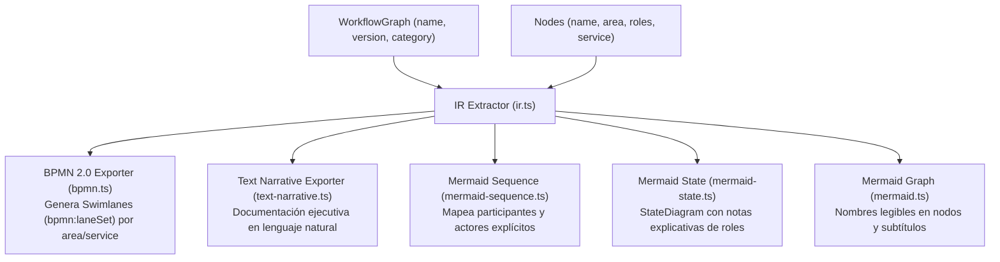

# Estrategia de Metadatos de Dominio Nativos en el Grafo y los Nodos

---

## 1. Objetivos y Principios de Diseño

La estrategia de **Metadatos de Dominio Nativos** en `dx-flow` tiene como objetivo enriquecer tanto el motor de orquestación como los exportadores visuales (Mermaid, BPMN 2.0, Narrativo, State, Sequence) con información declarativa de negocio, sin requerir claves mágicas, strings por defecto inventados en runtime ni anotaciones redundantes.

### Principios Fundamentales:
1. **Type-Safe DX Tiránica**: Todos los metadatos de dominio (`service`, `area`, `roles`, `actorType`) están validados por el sistema de tipos de TypeScript durante la compilación.
2. **Agnósticos e Interoperables**: Definidos a nivel de grafo y nodo, permitiendo que cualquier exportador consuma la misma fuente de verdad.
3. **Fallback Transparente e Implícito**:
   - Grafo: Si no se provee `name`, se utiliza `id` como fallback.
   - Nodo: Si no se provee `name`, se utiliza el `nodeId` clave como fallback.
4. **Eliminación de `sideEffects` Manuales**: Se descarta la anotación manual de efectos secundarios (`sideEffects: ["mutates: orderStatus"]`), ya que las mutaciones (`ctx.mutate()`), servicios e interacciones se deducen deterministamente de la estructura y firma del grafo.

---

## 2. Metadatos a Nivel de Grafo (`WorkflowGraph`)

El objeto retornado por `defineWorkflow().create({...})` acepta metadatos de gobernanza e identificación a nivel de raíz:

```ts
export interface WorkflowMetadata {
  /** Nombre legible de negocio del workflow (Fallback: `id`) */
  readonly name?: string;
  /** Descripción del propósito u objetivo de negocio */
  readonly description?: string;
  /** Versión semántica del diagrama o flujo (ej. "1.0.0") */
  readonly version?: string;
  /** Autor, equipo o célula responsable */
  readonly author?: string;
  /** Categoría o dominio funcional de negocio (ej. "Billing", "Logistics") */
  readonly category?: string;
  /** Etiquetas de clasificación e indexación */
  readonly tags?: readonly string[];
}

export interface WorkflowGraph<
  TState = any,
  TServices = any,
  TNodesList extends string = string,
  TEvents = Record<string, any>,
> extends WorkflowMetadata {
  readonly id: string;
  readonly nodes: Record<TNodesList, any>;
  readonly _types?: {
    readonly state: TState;
    readonly services: TServices;
    readonly events: TEvents;
  };
}
```

---

## 3. Metadatos a Nivel de Nodo (`BaseNodeMetadata`)

Cada nodo del grafo (`action`, `choose`, `delay`, `end`, `parallel`, `subworkflow`, `wait`, etc.) incorpora propiedades nativas de dominio en el primer nivel de su objeto para maximizar el autocompletado en el IDE:

```ts
export interface BaseNodeMetadata<
  TServices = any,
  TRoles extends string = string,
  TAreas extends string = string,
  TActorType extends string = "system" | "user" | "external",
> {
  /** Nombre/Título legible del nodo para diagramas (Fallback: `nodeId`) */
  readonly name?: string;
  /** Explicación detallada del paso */
  readonly description?: string;
  /** Identificador del servicio IoC inyectado (Autocompletado desde keyof TServices) */
  readonly service?: keyof TServices & string;
  /** Área organizacional de negocio responsable (Validado contra TAreas) */
  readonly area?: TAreas;
  /** Roles de usuario/sistema requeridos para ejecutar o autorizar (Validado contra TRoles) */
  readonly roles?: readonly TRoles[];
  /** Naturaleza del ejecutante (Validado contra TActorType) */
  readonly actorType?: TActorType;
}
```

---

## 4. Firma Genérica de `defineWorkflow`

La factoría central de workflows amplía su firma genérica para recibir los catálogos de dominio con valores por defecto sensatos (`opt-in strictness`):

```ts
export const defineWorkflow = <
  TState,
  TServices,
  TEvents = Record<string, any>,
  TRoles extends string = string,
  TAreas extends string = string,
  TActorType extends string = "system" | "user" | "external",
>() => {
  // ...
};
```

### Reglas de Inferencia y Validación:
- **`service`**: Se tipa automáticamente como `keyof TServices & string`. Si `TServices` posee `{ creditService: CreditService }`, el IDE autocompleta `"creditService"` y bloquea strings inexistentes.
- **`area`**: Validado estrictamente contra `TAreas`. Si se intenta escribir `"Riesgos"` en lugar de `"Riesgo Crediticio"`, TypeScript genera un error estático.
- **`roles`**: Validado contra `readonly TRoles[]`.
- **`actorType`**: Por defecto acepta `"system" | "user" | "external"`. Puede extenderse si la aplicación define ejecutantes personalizados (ej: `"ai_agent" | "hardware_device"`).

---

## 5. Impacto e Interoperabilidad en los Exportadores Visuales

Los exportadores consumen estos metadatos a través de la representación intermedia `extractWorkflowIR` (`src/workflow/exporters/ir.ts`):



### 1. Exportador BPMN 2.0 (`bpmn.ts`)
- **Swimlanes (`bpmn:laneSet` y `bpmn:lane`)**: Agrupa automáticamente las tareas por `area` o por `service`.
- **Etiquetas de Proceso**: Asigna el atributo `name` de las tareas utilizando `node.name || nodeId`.

### 2. Exportador Narrativo (`text-narrative.ts`)
- Documenta en lenguaje natural qué área y qué roles intervienen en cada paso del proceso:
  > **Paso 2: Aprobación de Crédito Manual** (`approveCredit`)
  > - **Área Responsable**: Riesgo Crediticio
  > - **Servicio IoC**: `riskAssessmentService`
  > - **Roles Requeridos**: `CreditAnalyst`, `RiskManager`
  > - **Tipo de Ejecutante**: Usuario humano (`user`)

### 3. Diagrama de Secuencia Mermaid (`mermaid-sequence.ts`)
- Mapea a cada `service` o `area` como un participante explícito (`participant RiskAssessmentService`) o un actor humano (`actor Analyst`).

---

## 6. Ejemplo Completo de Uso

```ts
import { defineWorkflow } from "./core/factory.js";

// Catálogos de Dominio de la Empresa
type CompanyRoles = "CreditAnalyst" | "RiskManager" | "FinanceAdmin";
type CompanyAreas = "Riesgo Crediticio" | "Finanzas" | "Operaciones";
type CustomActors = "system" | "user" | "external" | "ai_agent";

interface CompanyServices {
  riskAssessmentService: any;
  billingService: any;
}

const workflow = defineWorkflow<
  { orderId: string; amount: number },
  CompanyServices,
  { ORDER_APPROVED: { approvedBy: string } },
  CompanyRoles,
  CompanyAreas,
  CustomActors
>();

export const creditApprovalWorkflow = workflow.create({
  id: "credit-approval-v1",
  name: "Evaluación y Aprobación de Crédito",
  description: "Proceso de scoring crediticio automatizado con escalado a analista",
  version: "1.0.0",
  author: "Célula de Riesgos",
  category: "Finanzas",
  tags: ["credit", "risk", "critical"],
  nodes: {
    evaluateScoring: workflow.node.action({
      name: "Evaluación Automática de Scoring",
      description: "Calcula el score mediante el servicio de riesgo",
      service: "riskAssessmentService", // ✅ Autocompletado desde CompanyServices
      area: "Riesgo Crediticio",        // ✅ Validado contra CompanyAreas
      actorType: "system",
      action: async (state, ctx) => { /* ... */ },
      onSuccess: "approveBilling",
      onError: { LOW_SCORE: "manualReview" }
    }),
    manualReview: workflow.node.action({
      name: "Revisión Manual por Analista",
      description: "Evaluación por analista de crédito en caso de score ambiguo",
      service: "riskAssessmentService",
      area: "Riesgo Crediticio",
      roles: ["CreditAnalyst", "RiskManager"], // ✅ Validado contra CompanyRoles
      actorType: "user",
      action: async (state, ctx) => { /* ... */ },
      onSuccess: "approveBilling",
      onError: { REJECTED: "rejectOrder" }
    }),
    approveBilling: workflow.node.action({
      name: "Facturación de Orden",
      service: "billingService",
      area: "Finanzas",
      roles: ["FinanceAdmin"],
      actorType: "system",
      action: async (state, ctx) => { /* ... */ },
      onSuccess: "endProcess"
    }),
    endProcess: {
      type: "end",
      name: "Proceso Finalizado Exitosamente",
      result: "success"
    }
  }
});
```
