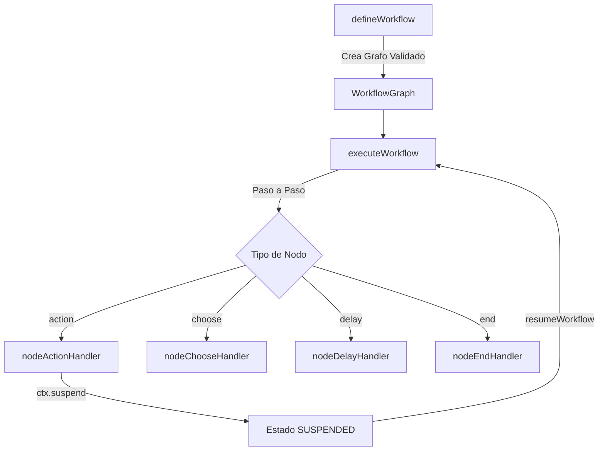

# Motor de Workflow Durable (Fase 4)

El **Motor de Workflow Durable** es una infraestructura fuertemente tipada en TypeScript Estricto para orquestar flujos de trabajo de negocio con estado inmutable, IoC de servicios, mutaciones puras, suspensión por eventos externos y reanudación duradera.

---

## 🎯 Arquitectura del Motor



---

## 🔑 Características Principales

### 1. Inferencia Automática de Genericos
El orquestador `executeWorkflow` infiere automáticamente `TState`, `TServices`, `TMutations` y `TEvents` desde la definición del `WorkflowGraph`:

```typescript
const wf = defineWorkflow<TState, TServices, TMutations, TEvents>();
```

### 2. Nodos Primitivos Nativo
- **`action`**: Ejecuta lógica de negocio. Puede mutar el estado (`ctx.mutate`), llamar servicios IoC (`ctx.services`), suspenderse dinámicamente (`return ctx.suspend("EVENTO")`), o retornar códigos de error mapeados en `onError`.
- **`choose`**: Bifurcación condicional declarativa (`choices` / `otherwise`).
- **`delay`**: Ventana de espera temporal (`durationMs` / `onTimeout`), mockeable en tests mediante `delayFn`.
- **`end`**: Nodo terminal de finalización (`status`).

### 3. Suspensión Dinámica y Reanudación Duradera (`Plan B`)
- **Suspensión**: Un nodo `action` suspende el workflow retornando `return ctx.suspend("EVENTO")`.
- **Payload Tipado**: Al reanudar con `resumeWorkflow(suspendedResult, { signalPayload })`, el objeto `ctx.signalPayload` se tipa automáticamente según `TEvents`.

---

## 💻 Ejemplo de Uso Completo

```typescript
// 1. Grafo
const graph = wf.create({
  id: "mi_workflow",
  nodes: {
    start: {
      type: "action",
      action: (state, ctx) => {
        if (!ctx.signalPayload) {
          return ctx.suspend("WEBHOOK_RECIBIDO");
        }
        ctx.mutate("REGISTRAR", { txId: ctx.signalPayload.txId });
      },
      onSuccess: "fin",
    },
    fin: { type: "end", status: "EXITO" },
  },
});

// 2. Ejecución inicial (se suspende)
const res1 = await executeWorkflow({ graph, initialState, services, mutations });
// res1.status === "SUSPENDED"

// 3. Reanudación
const res2 = await resumeWorkflow(res1, { graph, services, mutations, signalPayload: { txId: "TX123" } });
// res2.status === "COMPLETED"
```
